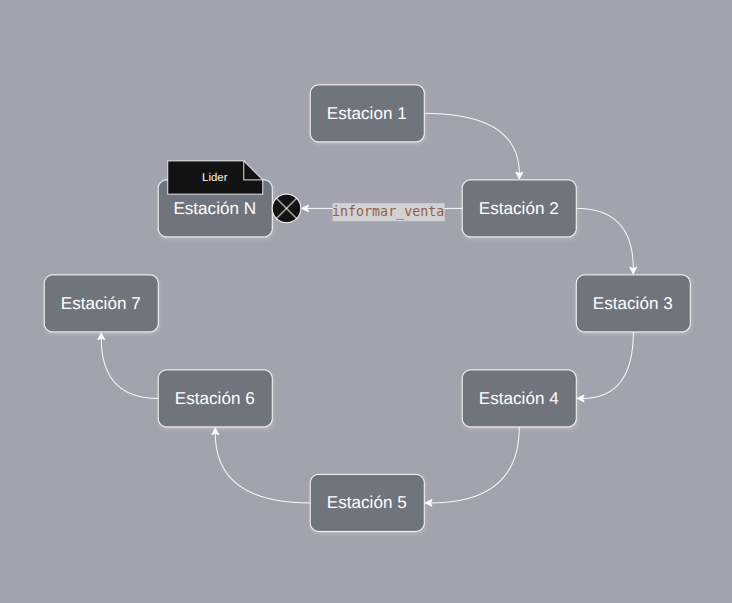
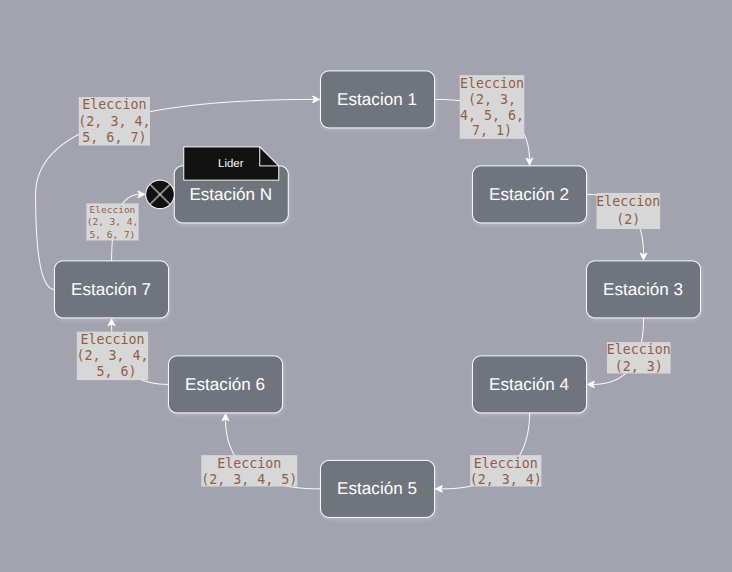
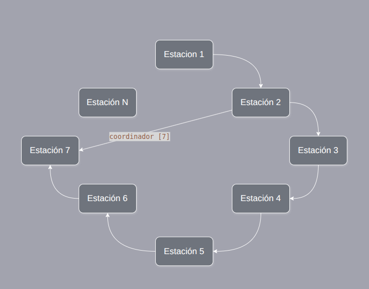
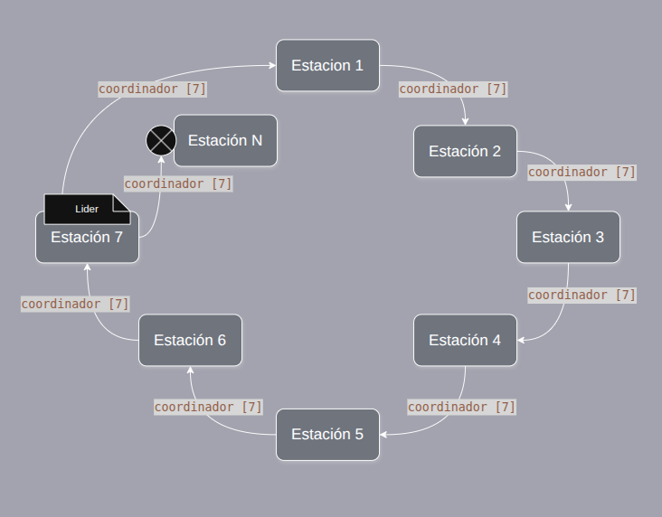
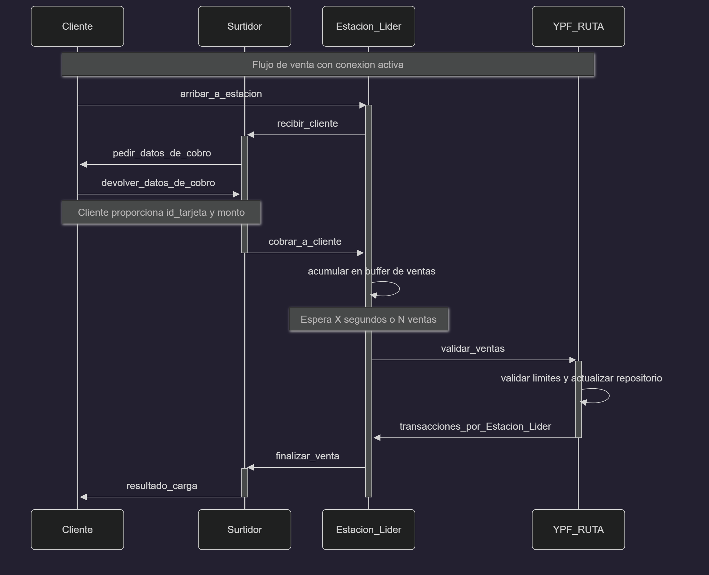
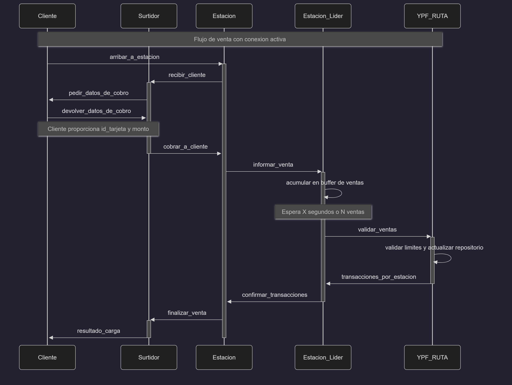
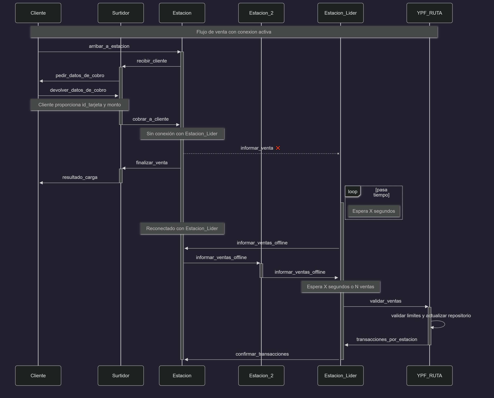

# YPF Ruta

Trabajo Práctico Grupal - Programación Concurrente - Cátedra Deymonnaz

Segundo Cuatrimestre 2025

**Integrantes**:

* Melina Retamozo - 110065
* Ariel Folgueira - 109473
* Matias Daniel Mendiola Escalante - 110379
* Gian Luca Spagnolo - 108072

## Tabla de Contenidos

- [YPF Ruta](#ypf-ruta)
  - [Tabla de Contenidos](#tabla-de-contenidos)
  - [Detalles de la Implementacion](#detalles-de-la-implementacion)
    - [División regional](#división-regional)
    - [Elección de líder](#elección-de-líder)
    - [Agrupación de ventas](#agrupación-de-ventas)
    - [Validación de ventas offline](#validación-de-ventas-offline)
    - [Validación de ventas online](#validación-de-ventas-online)
  - [Entidades Principales](#entidades-principales)
    - [Estación](#estación)
    - [Surtidor](#surtidor)
    - [Cliente](#cliente)
    - [YPF RUTA](#ypf-ruta-1)
    - [Empresa](#empresa)
  - [Structs del Payload de los mensajes](#structs-del-payload-de-los-mensajes)
    - [Mensajes de Estación](#mensajes-de-estación)
    - [Mensajes de Surtidor](#mensajes-de-surtidor)
    - [Mensajes de Cliente](#mensajes-de-cliente)
    - [Mensajes de YPF RUTA](#mensajes-de-ypf-ruta)
    - [Mensajes de Empresa](#mensajes-de-empresa)
  - [Protocolo de Transporte](#protocolo-de-transporte)
  - [Casos de Interés](#casos-de-interés)

---

## Detalles de la implementacion

### División regional

Las estaciones se encuentran divididas por región, cada una con su respectivo líder. Este se encarga de centralizar la comunicación con  **YPF RUTA** y se elige mediante el algoritmo `Ring Algorithm`.

El propósito de esto es el de minimizar los mensajes enviados a YPF RUTA por medio de la agrupación de mensajes de venta de todas las estaciones de una misma región.

### Elección de líder

Para la elección de líder se utilizará el algoritmo de anillo (Ring Algorithm). Cada estación conoce las demás estaciones de su región y sus respectivos IDs. Cuando una estación detecta que el líder no responde, inicia el proceso de elección enviando un mensaje a través del anillo. Cada estación que recibe el mensaje agrega su ID y lo reenvía al siguiente nodo del anillo. Cuando el mensaje vuelve al nodo que lo inició, este determina el nuevo líder (el ID más alto) y le envía el mensaje de coordinación al ganador, quien lo reenvía a través del anillo para notificar a todas las estaciones de la región.

<figure>
  
  <figcaption>Una estación intenta notificar una venta pero descubre que el lider no responde.</figcaption>
</figure>

<figure>
  
  <figcaption>La estación inicia una elección enviando un mensaje a través del anillo. Cada estación agrega su id y reenvía el mensaje.</figcaption>
</figure>

<figure>
  
  <figcaption>El mensaje vuelve al nodo que lo inició, este determina el nuevo lider y envía el mensaje de coordinación al ganador.</figcaption>
</figure>

<figure>
  
  <figcaption>El nuevo lider reenvía el mensaje de coordinación a través del anillo para notificar a todas las estaciones de la región.</figcaption>
</figure>

### Agrupación de ventas

Una vez elegido el líder, cada una de las estaciones de la región le enviarán las ventas por confirmar. Estas se acumulan durante un período de tiempo razonable (de tres a cinco segundos) para su posterior envío a YPF RUTA en un único mensaje.

### Validación de ventas offline

En el caso de que una estación se encuentre totalmente incomunicada, se aprobarán de forma temporal todas las ventas realizadas sin validar con YPF RUTA (las cuales serán marcadas como que fueron realizadas sin conexión), priorizando que la estación continue funcionando. Una vez recupere la conexión, se notificarán todas las ventas realizadas a YPF RUTA.

La notificación de ventas offline se realizará por medio de un "anillo" iniciado periódicamente por el líder (30 segundos o más) donde se pasará un mensaje entre estaciónes levantando todas las ventas realizadas de forma offline que se encuentren pendientes de informar. Una vez que el líder recibe nuevamente el mensaje, las agrega a la lista de ventas a validar, y se notificarán cuando se envíe dicho mensaje.

De esta forma YPF asume el riesgo de validar una venta por fuera del límite de una empresa perdiendo el monto de dicha transacción.

### Validación de ventas online

Cuando una estación recibe una venta para validar, se la envía al líder y la guarda hasta recibir el rechazo o confirmación de la misma. Esto con el propósito de evitar pérdidas de información en el caso de que la estación lider sufra una desconexión.

### Surtidores como tasks (actix) de cada Estación

Los surtidores se implementarán como tasks de cada estación cuya función es simular el tiempo requerido para la carga de combustible y manejar la comunicación con el cliente. Cuando la estación recibe un cliente, lanza una task surtidor que se encargará de pedirle los datos de cobro y enviar por medio de un canal interno el mensaje a la estación para que esta gestione la venta quedando a la espera de la respuesta para enviar el resultado al cliente y finalizar la task junto a la conexión del cliente.

## Suposiciones

* La desconexión de una estación implica únicamente la pérdida de comunicación con la región y no la propia caída de su sistema.

* En el caso de la aprobación de una venta por fuera del límite de la empresa o de (por falta de conexión), YPF asumirá la pérdida.

* YPF RUTA no puede perder la conexión.

---

## Entidades Principales

### Estación

**Finalidad** \
Representa una estación de YPF que recibe a los clientes y los distribuye entre los surtidores disponibles. Además, se encarga de informar a **YPF RUTA** sobre las ventas realizadas. En caso de que se caiga la conexión con el servidor central, puede almacenar temporalmente las ventas para reenviarlas una vez restablecida la comunicación.

**Estado interno**

```rust
Estacion {
    id_estacion: i32,
    surtidores_estado_sender: List<channel>,
    ventas_sin_informar: List<Venta>,
    ypf_socket: socket,
    estaciones_regionales : List<i32>,
    id_lider : i32,
    clientes_en_cola: Queue<client_sender>
}
```

<!-- Estacion crea tarea -> tarea simula hacer algo -> tarea le responde a estacion -> estacion hace las cosas y eventualmente le dice a tarea que termine -->

**Mensajes que recibe**

<!-- RECIBO COMO LIDER  -->
* `transacciones_por_estacion(List<Estacion, List<Transaccion>>)`: (Unicamente recibido por Estación Lider) recibe los resultados de las validaciones de venta desde `YPF RUTA` y envía a cada estación el resultado correspondiente.

<!-- RECIBO COMO NO LIDER -->
* `cobrar_a_cliente`: enviarle al lider la solicitud de validación de venta o guardar la venta en modo offline si no hay conexión. Si sos lider lo acumulas con el resto de ventas pendientes.
* `confirmar_transacciones(List<Transaccion>)`: le informa a cada estación el resultado de sus transacciones

* `informar_venta`: Encola los pedidos y eventualmente informa a `YPF RUTA` que tiene que cobrarle a un cliente.
* `informar_ventas_offline`: Levanta todos los pedidos realizados en modo offline y los envia al anillo para que sean informados a `YPF RUTA`.

* `eleccion(id)`: Se detectó una caida del lider actual entonces agrega su id y reenvia el mensaje al siguiente nodo del anillo.
* `coordinador(id_lider)`: Cambia el lider actual al id recibido.
* `consultar_estacion_lider`: Devuelve la respuesta a la consulta con el id del lider.
* `notificar_estacion_lider`: Recibe el id del lider que haya en el momento.

**Mensajes que envía**

<!-- ENVIO POR ANILLO -->
* `eleccion` -> `Estacion`
* `coordinador` -> `Estacion`
* `informar_ventas_offline` -> `Estacion`

<!-- ENVIO COMO LIDER -->
* `validar_ventas` -> `YPF Ruta`
* `confirmar_transacciones` -> `Estacion`

<!-- ENVIO COMO NO LIDER -->
* `finalizar_venta` -> `Surtidor`
* `informar_venta` -> `Estacion`
* `consultar_estacion_lider` -> `Estacion`
* `notificar_estacion_lider` -> `Estacion`

**Protocolo de transporte**

* Comunicación TCP entre la estación y YPF RUTA.
* Comunicación TCP entre estación y estación.
* Comunicación local con los surtidores mediante canales. 
<!-- *(#TODO: ACLARAR COMO LO IMPLEMENTAMOS)* -->

---

### Surtidor

**Finalidad** \
Simula una unidad de carga de combustible que atiende a un cliente por vez. Envía a la estación las solicitudes de venta cuando finaliza la carga.

**Estado interno**

```rust
Surtidor {
    estacion_sender: channel,
    estacion_receiver: channel
}
```

**Mensajes que recibe**

* `finalizar_venta`: finaliza la conexión con el cliente y queda disponible para el siguiente.
* `devolver_datos_de_cobro`: recibe los datos del cliente para poder cobrarle.

**Mensajes que envía**

* `cobrar_a_cliente` -> `Estacion`
* `resultado_carga` -> `Cliente`
* `pedir_datos_de_cobro` -> `Cliente`

**Protocolo de transporte** \
Canal interno hacia la estación correspondiente.

---

### Cliente

**Finalidad** \
Representa a un conductor que llega a la estación para realizar una carga de combustible. Cada cliente tiene asociada una tarjeta identificadora para el venta.

**Estado interno**

```rust
Cliente {
    id_tarjeta: u32,
}
```

**Mensajes que recibe**

* `pedir_datos_de_cobro`: devuelve el monto que quiere cargar de nafta y el id de su tarjeta.
* `resultado_carga`: es libre de irse.

**Mensajes que envía**

* `devolver_datos_de_cobro` -> Surtidor

**Protocolo de transporte** \
TCP hacia la estación.

---

### YPF RUTA

**Finalidad** \
Actúa como servidor central del sistema. Administra la comunicación entre estaciones y empresas, y mantiene el registro global de ventas y límites de tarjetas.

**Estado interno**

```rust
YPFRuta {
    limites_generales: HashMap<idEmpresa, Monto>,
    limites_por_tarjetas: HashMap<idTarjeta, Monto>,
    repositorio_ventas: RepositorioVentas,
}
```

**Mensajes que recibe**

* `gastos_empresa`: recibe la solicitud de gastos de una empresa y responde con la lista de gastos asociados a sus vehículos.
* `configurar_limite`: recibe la solicitud de configuración de límite para una tarjeta específica y actualiza el estado interno. Envía confirmación a la empresa.
* `configurar_limite_general`: recibe la solicitud de configuración de límite general para una empresa y actualiza el estado interno. Envía confirmación a la empresa.
* `validar_ventas`: por cada venta recibida valida si puede ser aprobado según los límites establecidos y actualiza el repositorio de ventas. Además, envía el resultado de las validaciones a la estación correspondiente sólo para el caso de ventas online.

**Mensajes que envía**

* `gastos_empresa_respuesta` -> Empresa
* `confirmacion_limite` -> Empresa
* `confirmacion_limite_general`-> Empresa
* `transacciones_por_estacion` -> Estación

**Protocolo de transporte** \
TCP contra estaciones y empresas.

---

### Empresa

**Finalidad** \
Representa una empresa asociada a tarjetas YPF Ruta. Se encarga de validar ventas y administrar límites de gasto de sus vehículos.

**Estado interno**

```rust
Empresa {
    idEmpresa: i32,
    ypf_socket: Socket

}
```

**Mensajes que recibe**

* `gastos_empresa_respuesta`: recibe lista de gastos por vehículo y los transforma para mostrar al administrador.
* `confirmacion_limite`: muestra el resultado de la operación y para que vehículo.
* `confirmacion_limite_general`: muestra el resultado de la operación.

**Mensajes que envía**

* `configurar_limite` -> `YPF Ruta`
* `gastos_empresa` -> `YPF Ruta`
* `configurar_limite_general` -> `YPF Ruta`

**Protocolo de transporte** \
TCP entre YPF Ruta y cada empresa.

---

## Structs del Payload de los mensajes

* `venta`

```rust
struct Venta {
    id_venta: i32,
    id_tarjeta: i32,
    monto: f32,
    id_estacion: i32,
    timestamp: i64,
    offline: bool,
    estado: VentaEstado,
}
```

* `venta_estado`

```rust
enum VentaEstado {
    Pendiente,
    Aprobada,
    Rechazada,
}
```

### Mensajes de Estación

* `eleccion`

Cuando una estación intenta notificar un pago puede descubrir que el lider no responde, entonces inicia una eleccion. Cada estación dentro de una región recibe este mensaje a través del anillo, agrega su id a la lista y lo reenvia al siguiente nodo.

```rust
struct Eleccion {
    aspirantes_ids: List<i32>,
}
```

* `coordinacion`

Una vez que el mensaje de eleccion vuelve al nodo que lo inició, este determina el nuevo lider (el id mas alto) y le envía el mensaje de coordinacion al ganador de la elección y este lo reenvía a través del anillo para notificar a todos las estaciones de la región.

```rust
struct Coordinador {
    id_lider: i32,
}
```

* `informar_ventas_offline`

Cada cierto periodo de tiempo, el líder envía este mensaje a través del anillo para que cada estación le envíe las ventas offline que haya acumulado.

```rust
struct InformarVentasOffline {
    ventas_offline: List<Venta>
}
```

* `validar_ventas`

La estación líder de cada región envía periódicamente este mensaje a `YPF RUTA` con la lista de ventas a validar.

```rust
struct ValidarVentas {
    ventas: List<Venta>
}
```

* `confirmar_transacciones`

La estación líder envía este mensaje a cada estación con el resultado de las validaciones de ventas.

```rust
struct ConfirmarTransacciones {
    transacciones: List<Venta>,
}
```

* `finalizar_venta`

Cuando la estación recibe la respuesta del líder le envía este mensaje al surtidor para que le informe al cliente el resultado de la carga.

```rust
struct FinalizarVenta {
    venta: Venta,
}
```

* `informar_venta`

La estación envía este mensaje al líder para notificarle de una nueva venta a validar.

```rust
struct InformarVenta {
    venta: Venta,
}
```

* `notificar_estacion_lider`

Respuesta a `consultar_estacion_lider`. La estación notifica cual es el nuevo lider a una estacion previamente desconectada.

```rust
struct NotificarEstacionLider{
    id_lider: i32
}
```

### Mensajes de Surtidor

* `cobrar_a_cliente`

El surtidor envía este mensaje a la estación para notificarle a la Estación que debe cobrarle a un cliente.

```rust
struct CobrarACliente {
    venta: Venta,
}
```

* `resultado_carga`

El surtidor envía este mensaje al cliente para informarle el resultado de la carga.

```rust
struct ResultadoCarga {
    exito: bool
}
```

* `pedir_datos_de_cobro`

El surtidor envía este mensaje al cliente para solicitarle los datos necesarios para realizar el cobro.

```rust
struct PedirDatosDeCobro {
    hola: bool
}
```

### Mensajes de Cliente

* `devolver_datos_de_cobro`

Cliente devuelve los datos necesarios para que empiece el cobro

```rust
struct devolver_datos_de_cobro {
    monto: f32,
    id_tarjeta: i32
}
```

### Mensajes de YPF RUTA

* `gastos_empresa_respuesta`

YPF Ruta envía este mensaje a una empresa con la lista de gastos asociados a sus vehículos.

```rust
struct GastosEmpresaRespuesta {
    gastos_por_vehiculo: HashMap<i32, List<Venta>>
}
```

* `confirmacion_limite`

YPF Ruta envía este mensaje a una empresa con el resultado de la actualización del límite para un vehículo en particular.

```rust
struct ConfirmacionLimite {
    id_vehiculo: i32
    exito: bool
}
```

* `confirmacion_limite_general`

YPF Ruta envía este mensaje a una empresa con el resultado de la actualización del límite general.

```rust
struct ConfirmacionLimiteGeneral {
    exito: bool
}
```

* `transacciones_por_estacion`

YPF Ruta envía este mensaje a una estación lider como respuesta a confirmar transacciones, conteniendo el estado actualizado de las ventas.

```rust
struct TransaccionesPorEstacion {
    transacciones: List<Venta>
}
```

### Mensajes de Empresa

* `configurar_limite`

La empresa envia este mensaje a YPF Ruta para actualizar el límite de un vehiculo en particular

```rust
struct ConfigurarLimite {
    id_empresa: i32,
    id_vehiculo: i32,
    nuevo_limite: i32,
}
```

* `configurar_limite_general`

La empresa envia este mensaje a YPF Ruta para actualizar su limite general mensual

```rust
struct ConfigurarLimiteGeneral {
    id_empresa: i32,
    nuevo_limite: i32,
}
```

* `gastos_empresa`

La empresa envia este mensaje a YPF Ruta para obtener todos sus gastos

```rust
struct GastosEmpresa {
    id_empresa: i32,
}
```

---

## Casos de interés positivos


Diagrama en caso funcional de una estacion siendo lider


Diagrama en caso funcional de una estacion sin ser lider

---

## Casos de interés negativos

### Desconexion de estacion lider



En caso de que una estacion pierda conexion, la misma intentará comunicarse con la estación lider pero notará que no lo puede hacer dado que perdió la conexion, entonces guardará las ventas realizadas como offline. Cuando eventualmente recupere la conexion y reciba el mensaje `informar_ventas_offline`, consultará si hay una nueva Estacion Lider mandando `consultar_estacion_lider` hacia alguna estación vecina.

### Casos bordes

- **Estacion líder pierde conexión luego de recibir la respuesta de YPF RUTA**. \
    Cuando un líder pierde la conexión, eventualmente se elegirá un nuevo líder y puede suceder que alguna estación estuviese esperando la confirmación de una venta por parte de aquel líder caído. Al no recibirla, intentará reenviar la venta al nuevo líder. Si el líder anterior se desconectó luego de enviar las ventas a *YPF RUTA* puede ocurrir que al servidor le llegue una venta duplicada, pero esto no afectará el comportamiento del sistema ya que *YPF RUTA* se encarga de validar las ventas y, en caso de encontrar algún id de venta duplicado, simplemente enviará el estado (confimado/rechazado) que ya validó previamente.

- **Estacion lider pierde conexion antes de mandar las ventas a YPF RUTA (validar_ventas) teniendo ventas a informar**. \
    La estación líder almacena las ventas a informar recibida por parte de otras estaciones junto a las propias y las envía periódicamente a YPF RUTA. Si la estación líder pierde la conexión antes de enviar las ventas a YPF RUTA, entonces deberá descartar todas las ventas online almacenadas (excepto las propias) dado que cada estación se encargará de reenviar las ventas pendientes al nuevo líder una vez que sea elegido.

- **Estacion pierde conexion con clientes encolados**. \ 
    Si una estación pierde la conexion y aún tiene clientes encolados, estos serán atendidos normalmente. La estación continuará funcionando y procesando las ventas de forma offline hasta que recupere la conexion. 

- **Ex lider puede intentar mandar mensaje de informar ventas offline**. \
    Si una estación lider pierde la conexion, este mismo se quita el estado de lider de modo que para cuando vuelva a reconectarse esta estación no intentará crear una ronda de informar ventas offline como si fuese un lider, solo simplemente asumirá que hay un nuevo lider.

- **Estacion pierde conexion luego de informar venta al lider**. \
    Si una estación pierde la conexion luego de mandar el mensaje `informar_venta` a la Estacion Lider, eventualmente esta última intentará confirmarle las ventas, pero no lo logrará. Mientras esto ocurra, las ventas activas (aún en proceso de aceptarse) de esta estación pasarán a offline y los clientes podrán retirarse. Eventualmente la Estacion lider tendrá que confirmarle a cada estación otras ventas realizadas, y en ese momento revisará si tiene que confirmarle alguna venta a una estacion desconectada.
